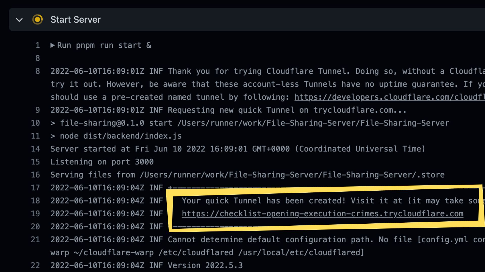
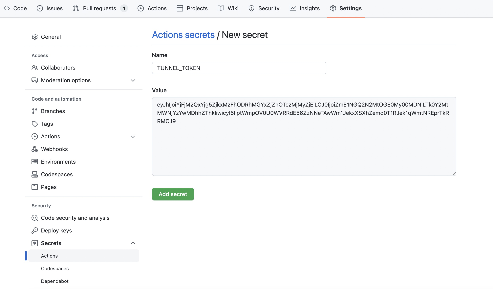

# File Sharing Server

A Secured Temporary File Sharing Server runs on GitHub Actions.

## Features

- [x] Fast
  - [x] Zero Configuration
  - [x] One-Click Start
- [x] Secure
  - [x] HTTPS / WSS
  - [x] Path Traversal Protection

## How

A Node.js file server with [cloudflared tunnel](https://try.cloudflare.com/).

## Usage

1. [Fork](https://github.com/JacobLinCool/File-Sharing-Server/fork).
2. Go to [Action](../../actions/workflows/file-sharing.yml), click `Run workflow`.
3. Find something like `https://some-random-words.trycloudflare.com` in the output of `Start Server` step.
4. Access the url and start sharing!

### Authenticated Tunnel

You can set `TUNNEL_TOKEN` in GitHub Secrets, and it will automatically use the authenticated tunnel in the next run.

